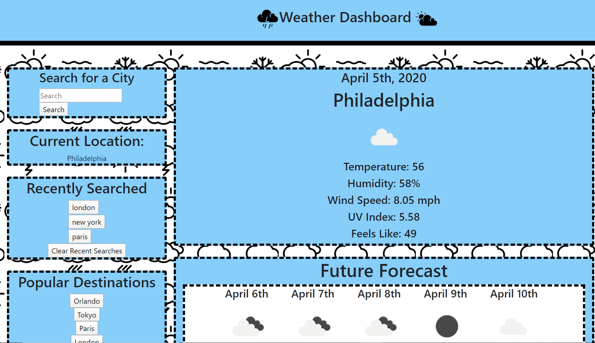
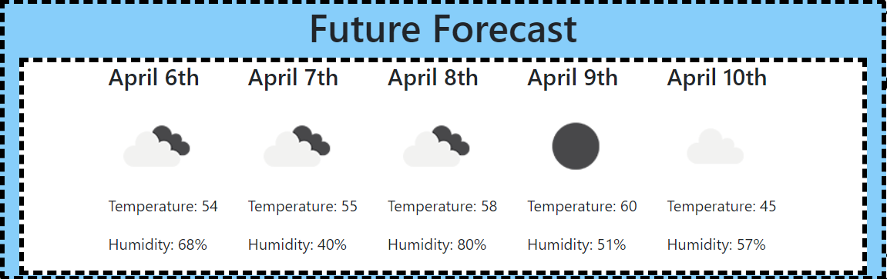

# Weather-Dashboard-ECB

# The Assignment

Developers are often tasked with retrieving data from another application's API and using it in the context of their own. Third-party APIs allow developers to access their data and functionality by making requests with specific parameters to a URL. Your challenge is to build a weather dashboard that will run in the browser and feature dynamically updated HTML and CSS.

Use the [OpenWeather API](https://openweathermap.org/api) to retrieve weather data for cities. The documentation includes a section called "How to start" that will provide basic setup and usage instructions. Use `localStorage` to store any persistent data.

# Where I started

I started with the format of the page with two columns. I then added cards to the two columns that made up the boxes that would hold the data. So for the left columna that included a search bar, a current location box, a recently searched card, and popular destination box. On the right I made a card that had todays forecast with a card underneath with the five day forecast.

# The middle steps

I then went on to do an ajax call to get todays weather. And with the response to that I filled in the two cards on the right with details. After that i went on to get the search button to work and for it to do its own ajax call to get todays weather. I then went on to get the popular destinations to do an ajax call.

# Final Touches

The last thing i did was to create local storage for the searched Cities. I then created buttons for them and when the button is pressed would prooduce an ajax call.

# Where I struggled

I struggled again with local storage. I got it to work pretty quickly this time but it was printing out everything that i had every searched. I also struggled with the UV index. I know it was supposed to change colors when it was high or low and i could not figure that out.

# What I would like to work on

I would love to add more functionality to this website. One example would be maybe the popular desitions when clicked would open up expedia flight details.

# Pictures

# Link to the page

https://eleanorburgess0940.github.io/Weather-Dashboard-ECB/
